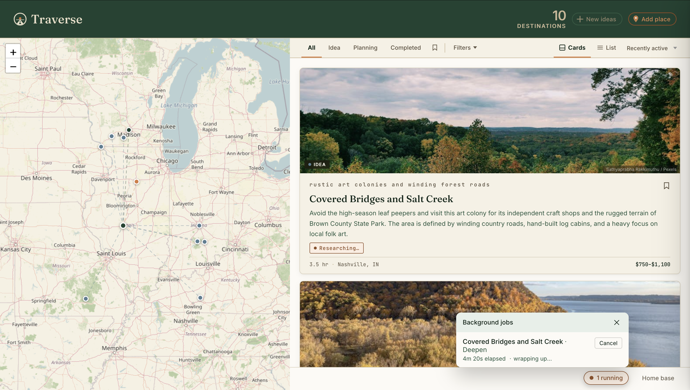
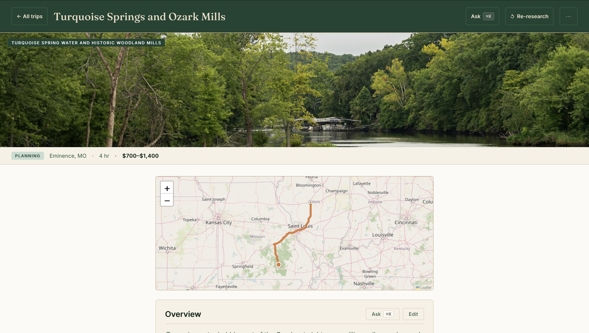
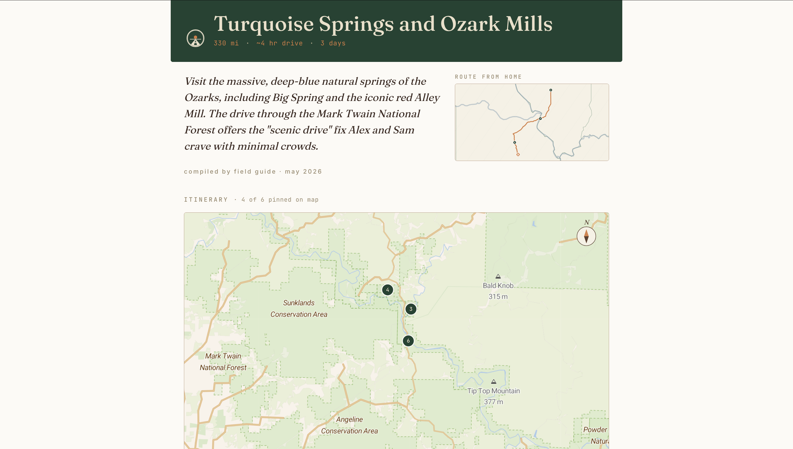

# Traverse

[](https://github.com/WrongerSandwich/traverse-trip-planner/actions/workflows/ci.yml)

A self-hosted road-trip filing cabinet. Trips live as plain markdown files, progressing through a lifecycle: **idea → planning → completed**. An LLM helps generate, research, and reflect on them — but the data is yours, on your disk, in a format you can read and grep without the app running.

> Built to be lived in, not to be sold. Stable enough for daily personal use, rough enough that you'll want to be the kind of person who's comfortable editing the markdown directly when something gets weird.



## Why this exists

There are plenty of fancier travel apps. Almost all of them treat your trips as rows in their database, your photos as content for their feed, and your destination history as something to monetize. Traverse takes the opposite bet: trips are markdown, your `home.md` is your taste preferences in plain English, and AI is a useful tool wired into the workflow — not the workflow itself.

The mental model is closer to a personal wiki than a SaaS app. The LLM is fast at generating regional ideas, fleshing out routes, and parsing a long planning thread into a printable brochure; you stay in control of what actually goes into the file. See [PRODUCT.md](PRODUCT.md) for the longer design rationale.

## What it does

- **Seed** — generate trip ideas based on your home base, taste, and constraints (uses an LLM)
- **Research** — flesh out an idea with live web-searched details: hours, prices, lodging, routes (uses an LLM + web search)
- **Plan** — edit trip sections in-browser, chat with the assistant to refine them, then lock the trip to generate a day-by-day itinerary
- **Retro** — when a trip is marked completed, an AI-prompted Q&A writes a `notes.md` retrospective (rating, highlights, would-do-again) you can revisit later
- **Map** — all trips rendered on an interactive map with drive-time routing
- **Filter** — by stage, drive time, cost tier, NPS units, bookmarks
- **Calendar** — subscribe to `/api/cal.ics` from Google/Apple/Outlook to see planned trips on your calendar; per-trip feed at `/api/cal/<slug>.ics`

All trip data is plain markdown on disk — readable, portable, and easy to edit directly.

## What it looks like

The detail view in Read mode — sections render as prose; click `✎ Edit` to surface authoring affordances:



The print-optimized brochure: cover photo, paper-map route inset from home, destination map with numbered pins, and structured stops:



Settings — the Home base tab edits `home.md` in-browser without dropping to a terminal:


## Self-hosting

Traverse is designed to be self-hosted. You bring your own API keys; nothing is shared.

**Requirements:**
- Node.js 20+
- A model provider API key — [Anthropic](https://console.anthropic.com/) or [OpenAI](https://platform.openai.com/) (for AI features)
- A [Pexels API key](https://www.pexels.com/api/) (free, for trip card photos)
- *Optional:* a [Tavily](https://tavily.com/) API key — required only if you use a non-Anthropic model and want the `Research →` (deepen) feature

See **[DEPLOY.md](DEPLOY.md)** for full setup instructions, including provider switching.

## Quick start

```bash
git clone <repo-url> traverse && cd traverse
cp home.example.md home.md   # edit with your home city, vehicles, taste
cp .env.example .env         # edit with your API keys
npm install
npm run seed-sample          # optional: load the bundled demo dataset
npm run smoke                # optional: 1-token round-trip per provider
npm run build
PORT=3456 node build/index.js
```

Open `http://localhost:3456`.

Prefer Docker? See [DEPLOY.md](DEPLOY.md#option-b--docker) for `docker compose up -d --build`.

## Trip data

Trips are markdown files organized by stage:

```
ideas/          # single .md files — lightly sketched
planning/       # folders with overview.md + research files; dates, lodging, edits
completed/      # archive with retrospective in notes.md
archived/       # hidden from UI; excluded from re-suggestion
```

These directories are **gitignored** — they hold your personal trips, not the project's source. A bundled demo dataset under `sample-data/` is available via `npm run seed-sample`; see [sample-data/README.md](sample-data/README.md) for details.

Your personal preferences live in `home.md` (also gitignored — see `home.example.md`). This file drives all AI prompts: home location, vehicle specs, taste profile, seasonal constraints.

## Tech

SvelteKit · Leaflet · OSRM (routing) · Nominatim (geocoding) · Pexels (photos). AI calls go through a provider-agnostic adapter — Anthropic and OpenAI are supported out of the box. See [DEPLOY.md](DEPLOY.md#provider-configuration-byok).

## Status

Used daily by the original author; published as open source for anyone who wants the same approach for their own trips. The single-user, self-hosted shape is the design center — multi-user accounts, hosted plans, and integrations beyond the listed providers are explicit non-goals. Expect rough edges and `home.md`-heavy assumptions; PRs that respect the philosophy are welcome.

## Contributing

PRs welcome. See [CONTRIBUTING.md](CONTRIBUTING.md) for setup and conventions; [SECURITY.md](SECURITY.md) for vulnerability reporting; [CODE_OF_CONDUCT.md](CODE_OF_CONDUCT.md) for community standards.

## License

MIT — see [LICENSE](LICENSE).
